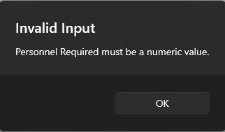

# Project work 1 - continuation

This Week I am continuing the task I was doing last week. I added new parameters and allowed the user to edit the entry as well. There are more stuff that was added which i will discuss below.

# Added new parameteres - "Disaster", "Personnel Required", "Assistance type"

<> Disaster - this parameter is for the type of disaster that the place was affected by (eg:Floods, Famine etc)
<> Personnel Required - this is an parameter which only accepts numbers (int) and is to show the number of personnel required for the issue at hand
<> Assistance type - this is for the type of humanitarian service needed. This field contains a drop down box with the options : "food", "shelter", "medical", "food and shelter", "food and medical", "shelter and medical" and "All"

# The update event handler for "add place"

```
private async void AddNewPlace_Clicked(object sender, EventArgs e)
        {
            // Get place name, status, disaster, personnel required, and assistance type from the user
            var placeName = await DisplayPromptAsync("Add New Place", "Enter the place name:");
            if (!string.IsNullOrWhiteSpace(placeName))
            {
                var status = await DisplayActionSheet("Select Status", "Cancel", null, "Open", "Closed", "In Progress");
                if (status != "Cancel")
                {
                    var disaster = await DisplayPromptAsync("Add New Place", "Enter the disaster:");
                    if (!string.IsNullOrWhiteSpace(disaster))
                    {
                        var personnelRequiredString = await DisplayPromptAsync("Add New Place", "Enter the personnel required:");
                        if (int.TryParse(personnelRequiredString, out int personnelRequired))
                        {
                            var assistanceType = await DisplayActionSheet("Select Assistance Type", "Cancel", null, "Food", "Shelter", "Medical", "Food and Shelter", "Food and Medical", "Shelter and Medical", "All");
                            if (assistanceType != "Cancel")
                            {
                                // Add the new place, status, disaster, personnel required, and assistance type to the list
                                placesList.Add(new PlaceStatus
                                {
                                    PlaceName = placeName,
                                    Status = status,
                                    Disaster = disaster,
                                    PersonnelRequired = personnelRequired,
                                    AssistanceType = assistanceType
                                });
                            }
                        }
                        else
                        {
                            await DisplayAlert("Invalid Input", "Personnel Required must be a numeric value.", "OK");
                        }
                    }
                }
            }
        }
```
# Explanation for the important lines of code
1.await DisplayPromptAsync("Add New Place", "Enter the place name:");: This line presents a prompt to the user, allowing them to enter the name of the new place. The entered value is stored in the placeName variable.

2.await DisplayActionSheet("Select Status", "Cancel", null, "Open", "Closed", "In Progress");: This line displays an action sheet with options for selecting the status of the new place (Open, Closed, In Progress)

3.int.TryParse(personnelRequiredString, out int personnelRequired): This line attempts to parse the entered personnelRequiredString as an integer. If successful, the parsed value is stored in the personnelRequired variable.

4.placesList.Add(new PlaceStatus { ... });: This line creates a new PlaceStatus object with the gathered information (place name, status, disaster, personnel required, and assistance type) and adds it to the placesList collection.

5.Error Handling: Throughout the method, there are checks to ensure that the user provides valid input. If there are issues (e.g., the user cancels an action or enters invalid data), 
  appropriate messages are displayed to the user using DisplayAlert.

# Having an "OnItemSelected" event handler when a item from the list view is selected to let the user edit its contents

```
 private async void OnItemSelected(object sender, SelectedItemChangedEventArgs e)
        {
            if (e.SelectedItem == null)
                return;

            // Deselect the item
            ((ListView)sender).SelectedItem = null;

            // Get the selected PlaceStatus item
            var selectedPlace = (PlaceStatus)e.SelectedItem;

            // Prompt the user to edit the place name
            var updatedPlaceName = await DisplayPromptAsync("Edit Place", "Enter the updated place name:", initialValue: selectedPlace.PlaceName);

            // If the user didn't cancel the prompt and entered a value
            if (!string.IsNullOrWhiteSpace(updatedPlaceName))
            {
                // Prompt the user to edit the status
                var updatedStatus = await DisplayActionSheet("Edit Status", "Cancel", null, "Open", "Closed", "In Progress");

                // If the user didn't cancel the action sheet
                if (updatedStatus != "Cancel")
                {
                    // Prompt the user to edit the disaster
                    var updatedDisaster = await DisplayPromptAsync("Edit Disaster", "Enter the updated disaster:", initialValue: selectedPlace.Disaster);

                    // If the user didn't cancel the prompt and entered a value
                    if (!string.IsNullOrWhiteSpace(updatedDisaster))
                    {
                        // Prompt the user to edit the personnel required
                        var updatedPersonnelRequiredString = await DisplayPromptAsync("Edit Personnel Required", "Enter the updated personnel required:", initialValue: selectedPlace.PersonnelRequired.ToString());

                        // If the user didn't cancel the prompt and entered a value
                        if (int.TryParse(updatedPersonnelRequiredString, out int updatedPersonnelRequired))
                        {
                            // Prompt the user to edit the assistance type
                            var updatedAssistanceType = await DisplayActionSheet("Edit Assistance Type", "Cancel", null, "Food", "Shelter", "Medical", "Food and Shelter", "Food and Medical", "Shelter and Medical", "All");

                            // If the user didn't cancel the action sheet
                            if (updatedAssistanceType != "Cancel")
                            {
                                // Update the selected PlaceStatus item with the new information
                                selectedPlace.PlaceName = updatedPlaceName;
                                selectedPlace.Status = updatedStatus;
                                selectedPlace.Disaster = updatedDisaster;
                                selectedPlace.PersonnelRequired = updatedPersonnelRequired;
                                selectedPlace.AssistanceType = updatedAssistanceType;

                                // Notify the ListView about the changes
                                UpdateListView();
                            }
                        }
                        else
                        {
                            await DisplayAlert("Invalid Input", "Updated Personnel Required must be a numeric value.", "OK");
                        }
                    }
                }
            }
        }

```
# Explanation 
1.Get Selected Item: var selectedPlace = (PlaceStatus)e.SelectedItem; retrieves the PlaceStatus object that corresponds to the selected item in the ListView.

2.Edit Place Name: var updatedPlaceName = await DisplayPromptAsync(...); prompts the user to enter the updated place name. The initial value is set to the current place name.

3.Edit Status: var updatedStatus = await DisplayActionSheet(...); prompts the user to select an updated status from an action sheet.

4.Update Selected PlaceStatus: The selected PlaceStatus item is updated with the new information obtained from the user.

5.Notify ListView Update: UpdateListView() is called to notify the ListView about the changes and refresh its display.


# UpdateListView() method
```
private void UpdateListView()
        {
            // Refresh the ListView by resetting its ItemsSource
            PlacesListView.ItemsSource = null;
            PlacesListView.ItemsSource = placesList;
        }
```
# Screenshot of each field


# Personnel Required field only accepting numbers



# The final view map page 


