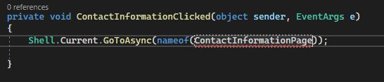
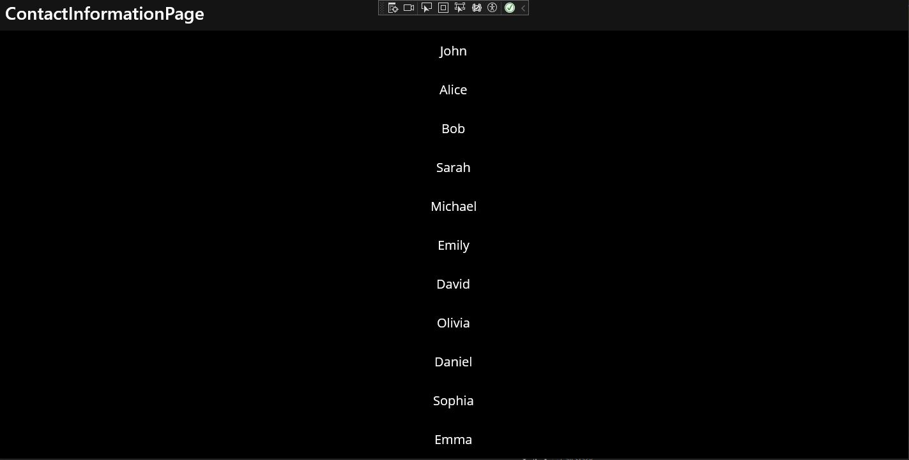

# Week 11 - New Issue

## The issue for this week
As an UNDAC Deputy Team Leader I want to view details of all team partners so that I can contact them immediately 

# Fuctions I want to implement
1)Having a database that stores just the contact information of the team patners (maybe also the status and where they are)

2)Being able to search for a specific patner

3)At first only name being displayed and the info being displayed if you click on name or any other action

4)Being able to add new team patner with relevant infromation

# Creating the button 


# Onclick Event Handler and creating a new file for the window



# The data
For this week I pre-defining the data(name and contact information) and then later changing it to a database implementation. This is the data I predefined 
```private Dictionary<string, string> contacts = new Dictionary<string, string>
        {
            { "John", "+1234567890" },
            { "Alice", "+1987654321" },
            { "Bob", "+1122334455" },
            { "Sarah", "+1555099887" },
            { "Michael", "+1789456123" },
            { "Emily", "+1654321890" },
            { "David", "+1888777666" },
            { "Olivia", "+1999777888" },
            { "Daniel", "+1777888999" },
            { "Sophia", "+1888999900" },
            { "Emma", "+1999888777" },
        };
```

# tapGestureRecognizer and how it is used in my program 
The inital idea for this was to make the "name" label a toggle so that on each click it would vary between showing only the name and showing the name + the contact information. But then I changed to using the tapGestureRecognizer
and opening "window" displaying all the information as this reduses screen clutter (unlike the original idea) and can show lot more information ( more ways of contacting and other traits).
```
foreach (var contact in contacts)
            {
                var label = new Label
                {
                    Text = contact.Key,
                    VerticalOptions = LayoutOptions.CenterAndExpand,
                    HorizontalOptions = LayoutOptions.CenterAndExpand,
                    FontSize = 20,
                    Margin = new Thickness(0, 10)
                };

                // Add tap gesture recognizer to each label
                var tapGestureRecognizer = new TapGestureRecognizer();
                tapGestureRecognizer.Tapped += (sender, e) =>
                {
                    var selectedLabel = (Label)sender;
                    DisplayPhoneNumber(selectedLabel);
                };
                label.GestureRecognizers.Add(tapGestureRecognizer);

                MainStackLayout.Children.Add(label);
            }
```
We first iterate through each key-value pair in the contacts dictionary and for each contact we create a new label with various properties.

```
tapGestureRecognizer.Tapped += (sender, e) => { ... }
```
This line defines what happens when the label is tapped. It attaches an event handler to the Tapped event of the gesture recognizer.

Inside the event handler, var selectedLabel = (Label)sender; retrieves the label that triggered the tap event.

Then the DisplayPhoneNumber(selectedLabel) method is used to show the phone number by passing the selected(clicked) label as the argument.
```
label.GestureRecognizers.Add(tapGestureRecognizer);
```
This way the TapGestureRecognizer associates with the label, enabling the label to respond to tap events.

Then at the end the newly created label (with its tap gesture recognizer attached) is added as a child to the MainStackLayout. This layout serves as a container for all the labels, arranging them vertically as they're added.

# Screenshots of the program 

The button in the UI


The main page


When the label is tapped
