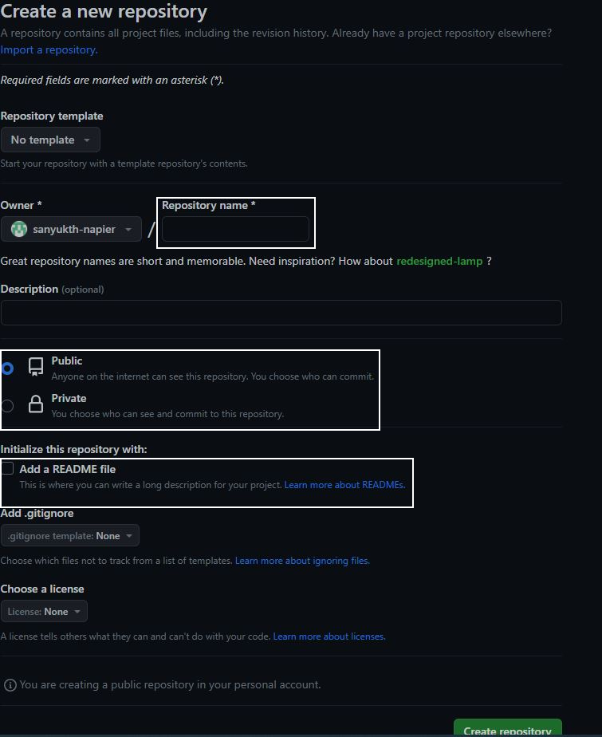

## Environment configuration
This week we have have to setup Github and Visual Studio 22. The scenario/project we are working on in this semester will be using C# programming language and Microsoft Visual Studio 
as the IDE. GitHub wil be used as the version control system

## Creating a shared repository

To create a working repository in Github we have to first make a account on Github. We only need a working email address and a secure passoword and a username for a new account.
You can signup by clicking on this link  http://www.github.com/signup.

After creating a new account, the next thing to do is to make a new repository. Click on the "+" at the top right to open the setup window.
Refer to the image below to see how to set up the repository.

1. Give an appropriate name to your repository, preferably something containing the word "portfolio"
2. You can make make the repository public or private if you only want your ccollaborators to see it 
3. Tick this the box to add a readme file

The click on the "Create repository" button at the bottom right 

All created repositories can be seen in the homepage of github, https://github.com/"yourGithubUsername", in the top left part of the page.

To created a shared repository you need to add collaborators to the repository you just made. Open your repository by clicking on it in the repository section.

1. Click on the settings page once you are in your repository main page
2. Then click on Collaborators
3. After that at the bottom you have to click on the green button "Add people"

You can add them using the email address the used to make the github account, it goes without saying that they need a Github account in the firt place.

## Reflection

