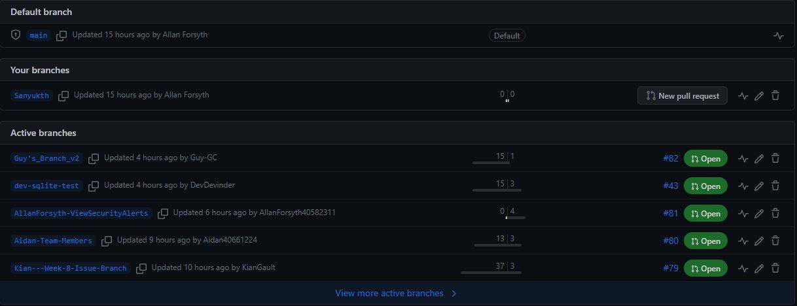

# Project work 1

 
# Creating a branch to work on


# Picking a task from the project board to work on
https://github.com/wardliii/Green-Team/issues/60
"As an UNDAC Team Leader I want to view an overall status map of the area so that I can react to changing events"

# Creating the button the view map

```
 <Button
                x:Name="ViewMapButton"
                Text="View Map"
                SemanticProperties.Hint="View Map"
                Clicked="ViewMapClicked"
                HorizontalOptions="Center" />

```

# Event Handler in MainPageXaml.cs

```
private void ViewMapClicked(object sender, EventArgs e)
        {
            // Handle the button click event here.
        }

```

# View Map Button created 

