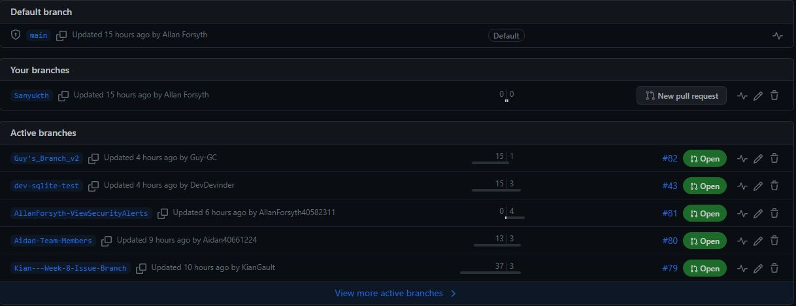
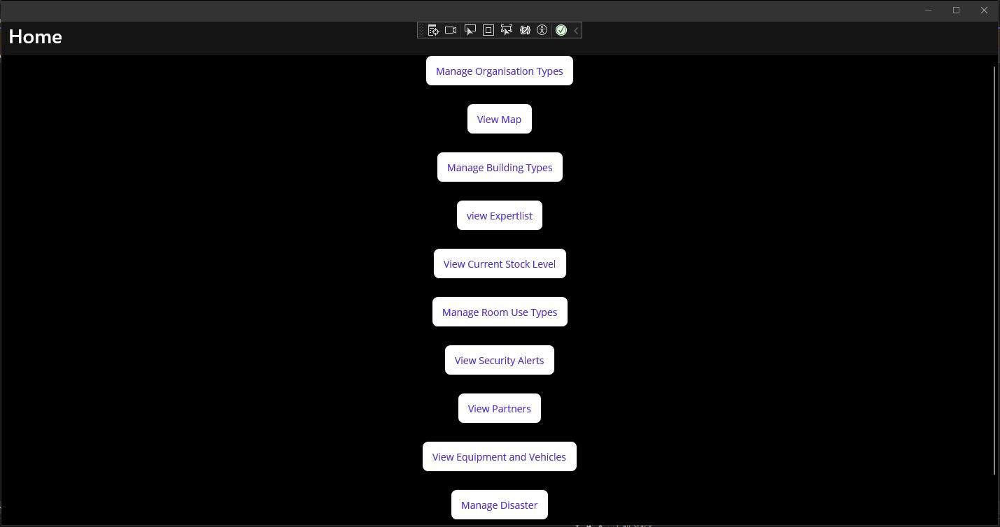
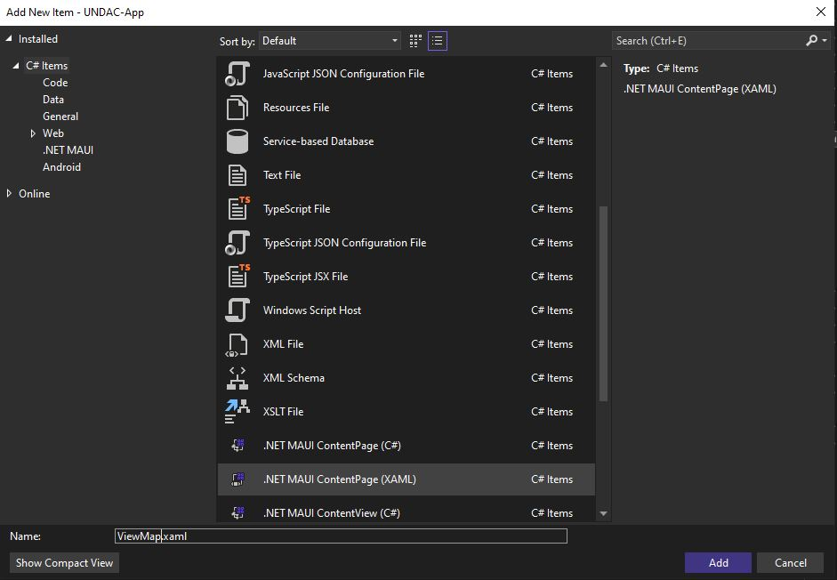
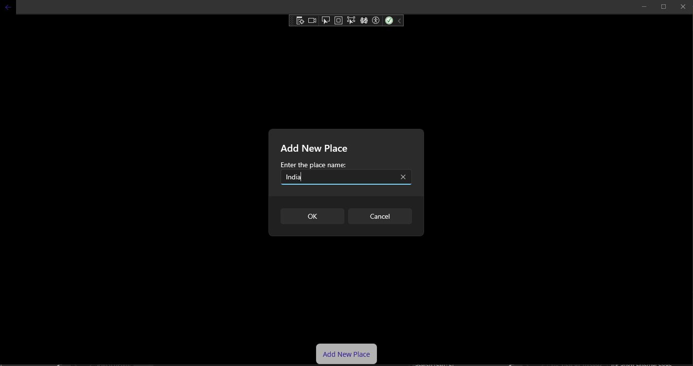
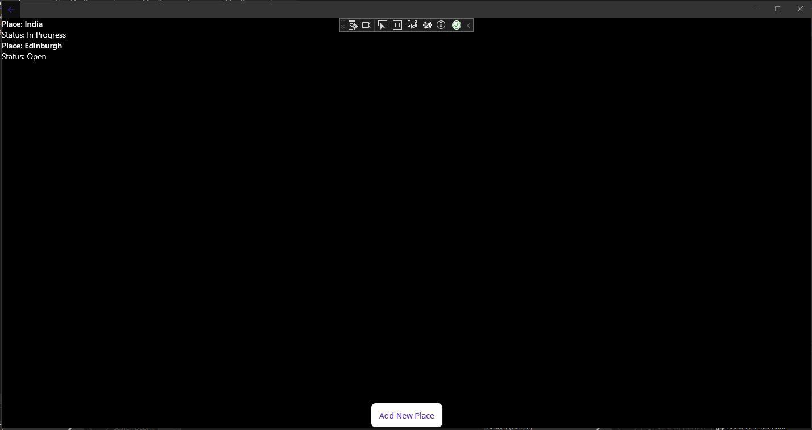

# Project work 1

 
# Creating a branch to work on


# Picking a task from the project board to work on
https://github.com/wardliii/Green-Team/issues/60
"As an UNDAC Team Leader I want to view an overall status map of the area so that I can react to changing events"

# Added User stories
"As an UNDAC Team Leader see information of the area I select"
"As an UNDAC Team Leader I want to edit the the information about the map"

# Definition of Done Checklist 
- Creating a viewMap button on the main page [ Time required - 10mins]
- Creating the viewMap page [ Time required - 10mins]
- Being able to add place [ Time required - 1 day]
    . Place name
    . Status
    . Personnel required 
    . Selecting assistance type
- Error check for Personnel required to only accept numerical [ Time required - 30mins ]
- Each Place and it's informtaion should be able to be edidted
- Should be aple to add new place to the list

# Creating the button the view map

```
 <Button
                x:Name="ViewMapButton"
                Text="View Map"
                SemanticProperties.Hint="View Map"
                Clicked="ViewMapClicked"
                HorizontalOptions="Center" />

```

# Event Handler in MainPageXaml.cs

```
 private void ViewMapClicked(object sender, EventArgs e)
        {
            Shell.Current.GoToAsync(nameof(ViewMapPage));

        }

```

# Registered a route for the page

```
Routing.RegisterRoute(nameof(ViewMapPage), typeof(ViewMapPage));

```
# View Map Button created 


# Creating the ViewMapPage

Now I have to make the acutal page that open when I click on the button, as you can see in my event handler code.


I add this file in the "Views" folder of the project.

This is the code in my ViewMapPage.xaml file.

```
 <?xml version="1.0" encoding="utf-8" ?>
<ContentPage
    x:Class="UNDAC_App.Views.ViewMapPage"
    xmlns="http://schemas.microsoft.com/dotnet/2021/maui"
    xmlns:x="http://schemas.microsoft.com/winfx/2009/xaml">

    <Grid>
        <Grid.RowDefinitions>
            <RowDefinition Height="*" />
            <RowDefinition Height="Auto" />
            <!-- Button row -->
        </Grid.RowDefinitions>

        <!-- ListView for displaying places and statuses -->
        <ListView
            x:Name="PlacesListView"
            Grid.Row="0"
            VerticalOptions="FillAndExpand">
            <ListView.ItemTemplate>
                <DataTemplate>
                    <TextCell Text="{Binding PlaceName}" Detail="{Binding Status}" />
                </DataTemplate>
            </ListView.ItemTemplate>
        </ListView>

        <!-- Button -->
        <Button
            Text="Add New Place"
            Clicked="AddNewPlace_Clicked"
            Grid.Row="1"
            HorizontalOptions="Center"
            VerticalOptions="End" />
    </Grid>
</ContentPage>

```
I created a button called "Add new place" and a ListView for diplaying the Places and Status on screen

# ViewMapPage.xaml.cs

```
using System.Collections.ObjectModel;

namespace UNDAC_App.Views
{
    /// <summary>
    /// Represents a page for viewing a map with a list of places and their statuses.
    /// </summary>
    public partial class ViewMapPage : ContentPage
    {
        private ObservableCollection<PlaceStatus> placesList = new ObservableCollection<PlaceStatus>();

        /// <summary>
        /// Initializes a new instance of the ViewMapPage class.
        /// </summary>
        public ViewMapPage()
        {
            InitializeComponent();
            PlacesListView.ItemsSource = placesList;
        }

        /// <summary>
        /// Event handler for the button click to add a new place and status.
        /// </summary>
        /// <param name="sender">The object that raised the event.</param>
        /// <param name="e">The event arguments.</param>
        private async void AddNewPlace_Clicked(object sender, EventArgs e)
        {
            // Get place name and status from the user
            var placeName = await DisplayPromptAsync("Add New Place", "Enter the place name:");
            if (!string.IsNullOrWhiteSpace(placeName))
            {
                var status = await DisplayActionSheet("Select Status", "Cancel", null, "Open", "Closed", "In Progress");
                if (status != "Cancel")
                {
                    // Add the new place and status to the list
                    placesList.Add(new PlaceStatus { PlaceName = "Place: " + placeName, Status = "Status: " + status });
                }
            }
        }
    }

    /// <summary>
    /// Represents the status of a place.
    /// </summary>
    public class PlaceStatus
    {
        /// <summary>
        /// Gets or sets the name of the place.
        /// </summary>
        public string PlaceName { get; set; }

        /// <summary>
        /// Gets or sets the status of the place.
        /// </summary>
        public string Status { get; set; }
    }
}

```

"private ObservableCollection <PlaceStatus> placesList" I am declraing a private collection named placesList of objects of type PlaceStatus. I am using this collection to store the places and their statuses that will be displayed
on the ListView

"PlacesListView.ItemsSource = placesList" This line is setting the ItemsSource propert of the ListView named PLacesListView to the placesList collection.This is done so that the ListView will display the item contained in
the collection

private async void AddNewPlace_Clicked(object sender, EventArgs e): This is an event handler for the "Add New Place" button's click event. When the button is clicked, this method is executed. It performs the following actions:

"private async void AddNewPlace_Clicked(object sender, EventArgs e)" This is my event handler for the "Add New Place Button". It prompts the user to enter a place nae using DisplayPromtAsync. If the user enter a place name
that is not empty it then shows an action sheet for the user to select status for the place. The selected status is stored in the status variable. If the user selects a status that is not cancel, it will create a new PlaceStatus
object with the place name and status and adds it to the collection. Then the newly added place and status are displayed in the ListView

The "PublicStatus" class is used to represent the place name and its status for each entry in the list.

# Screentshot of ViewMapPage


